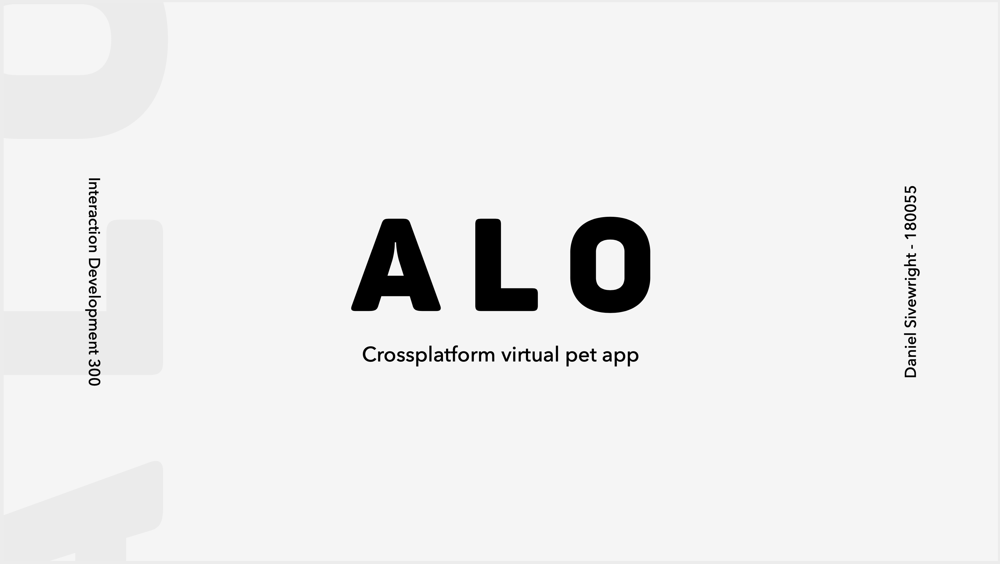

# IDV301 
This is a virtual pet application which aims to showcase the cross-platform capabilities of C# and Xamarin Forms

## Getting Started
1. Install [Visual Studio Community](https://visualstudio.microsoft.com/vs/community/) and [xamarin forms](https://docs.microsoft.com/en-us/xamarin/xamarin-forms/) 
2. Clone the repository 
> git clone https://github.com/DanSivewright/IDV301.git

3. Open Project in Visual Studio

4. Once open, tap the menu in the top right and ensure you create two plants before proceeding.

## Features and Functionality 

Here are the core features and functionality

### Features & Functionality
* Creating your own plant multiple times
* Watering the plant
* Giving it sunlight 
* Writing Notes to your plant
#### Additional Features
* The plants health in negatively impacted if it is given too much water and sunlight, as well as writing too many positive or negative notes. 

## Built With
**C#**
**Microsofts Xamarin Forms**

#### Aditional Technologies/ Nuget Packages
* SkiaSharp - [GitHub](https://github.com/mono/SkiaSharp)
* CardsView by [Andrei Misiukevich](https://github.com/AndreiMisiukevich/CardView)
* [SQLite](https://www.nuget.org/packages/System.Data.SQLite) Nuget Package

## Contributing

Pretty much everyone is smarter than me - I'm sure I could use your help

1. Fork the Project
2. Create your Feature Branch (`git checkout -b feature/AmazingFeature`)
3. Commit your Changes (`git commit -m 'Add some AmazingFeature'`)
4. Push to the Branch (`git push origin feature/AmazingFeature`)
5. Open a Pull Request

## Authors
* **Daniel Sivewright** - *Front End, Code Behond & Unit Testing* - [DanSivewright](https://github.com/DanSivewright)

## License  
This project is licensed under the MIT License - see the [LICENSE.md](LICENSE.md) file for details